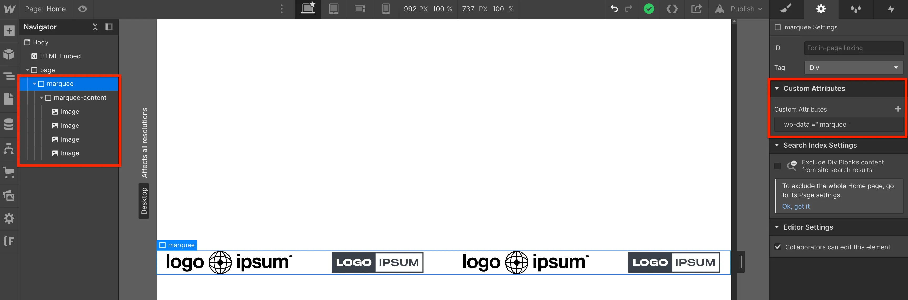

# WB-MARQUEE

A responsive scrolling marquee animation using HTML attributes and GSAP.


## Installation

1. Import the code from CDN

In the `<head>` tag

`<link rel="stylesheet" href="https://cdn.jsdelivr.net/gh/learyjk/wb-marquee@1/dist/wb-marquee.css">`

Before the `</body>` tag

`<script>https://cdn.jsdelivr.net/gh/learyjk/wb-marquee@1/dist/wb-marquee.js</script>`

2. Create a div with classname `marquee`. Give it a data attribute `wb-data="marquee"`
3. Create another div inside that one with classname `marquee-content`. Put your scrolling content in here.

Alternatively, drop this CSS into an embed on your Webflow page to see it in designer:

```
:root {
  --gap: 1rem;
}

.marquee {
  position: relative;
  display: flex;
  overflow: hidden;
  user-select: none;
  gap: var(--gap)
}

.marquee-content {
  flex-shrink: 0;
  display: flex;
  justify-content: space-around;
  min-width: 100%;
  gap: var(--gap);
}
```



[webbae.net](https://www.webbae.net)
